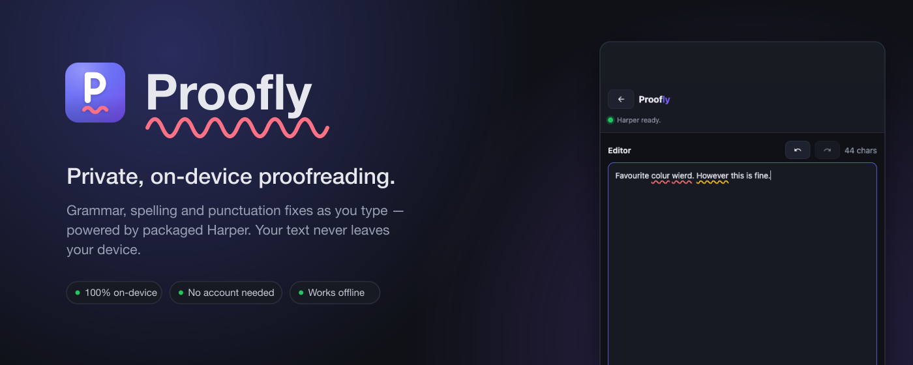
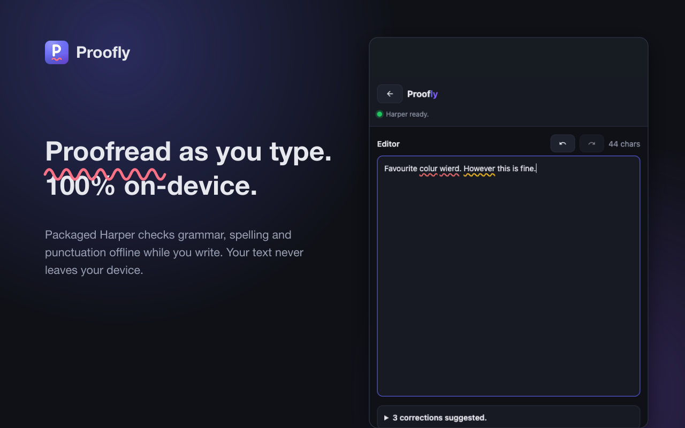
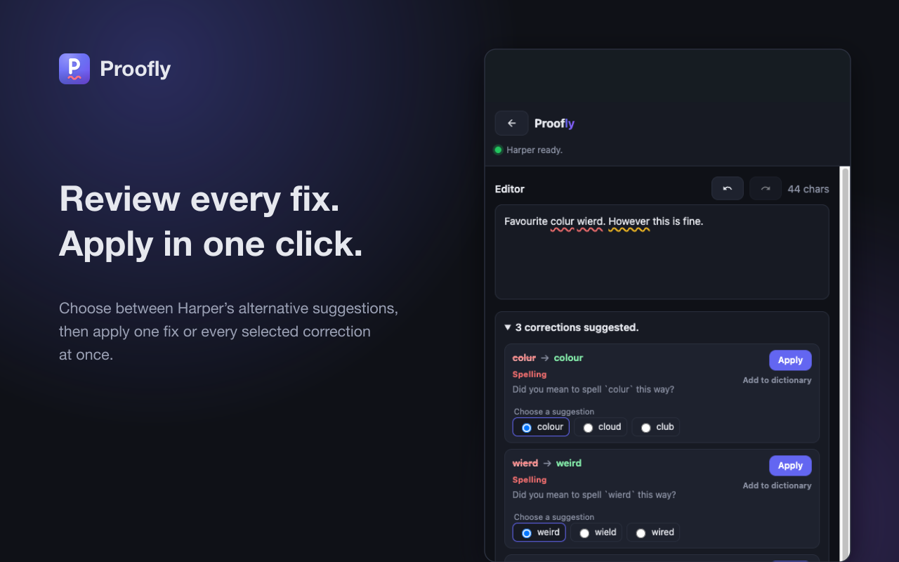
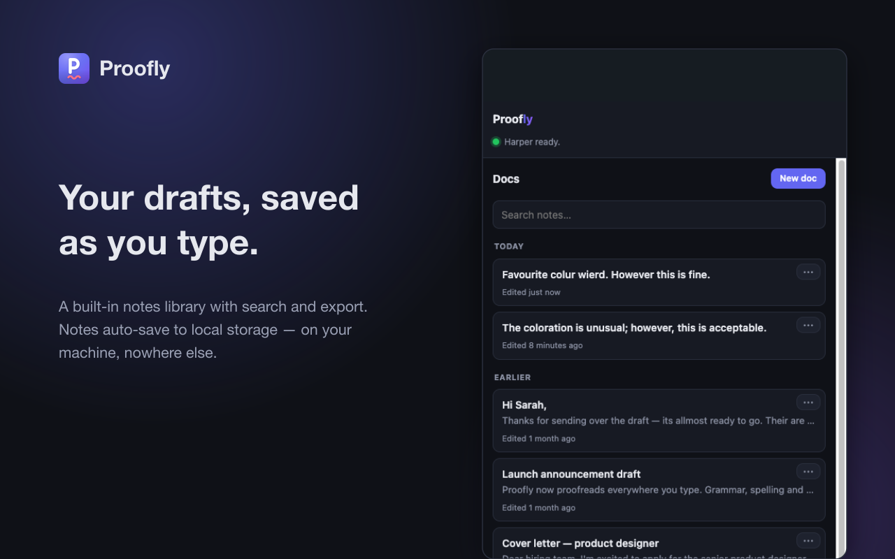

# Proofly

<p align="center">
  
</p>

**Proofly** is a Chrome extension for **private, on-device proofreading**,
powered by the packaged **Harper 2.4.0** English proofing engine. It puts an
editor pane in the browser **side panel** — you type, and grammar, spelling,
punctuation, capitalization, usage and style feedback comes back in real time
without downloading an AI model. It also **spell checks ordinary websites**:
turn Proofly on for a site and the same engine checks the fields you type in
right on the page — wavy underlines under the typos, one-click fixes. Proofly
distinguishes automatic **fixes** from informational **writing suggestions**
that Harper cannot apply. Everything runs **client-side**; your text never
leaves the device unless you explicitly turn on optional sync to your own
GitHub repo.

Proofreading—including spelling—is always handled by Harper. Gemini Nano is
used only by the optional Rewrite feature when Chrome's built-in Rewriter API
is enabled.

<p align="center">
  
  
</p>
<p align="center">
  
  
</p>

## Features

- **Proofread on any website (per-site opt-in)** — enable Proofly for a site
  from the toolbar menu and it proofreads the field you're typing in, right on
  the page: wavy underlines under the errors, click one for a popup with the
  replacement and an **Apply fix** action, or a category and explanation when
  Harper is offering advice rather than an edit. Works on plain `<textarea>`s, text
  `<input>`s, and simple `contenteditable` textbox editors such as Slack's
  message composer.
  Off everywhere by default — see
  [Proofread on any website](#proofread-on-any-website-per-site-opt-in) below.
- **Notes library ("Docs")** — Proofly is multi-note. The first thing you see is
  a library of saved notes (title, snippet, "Edited X ago", and a per-card "…"
  menu); opening one — or starting a new one — drops you into the editor with a
  **back arrow** to return. Notes **auto-save** as you type (and on Back), and the
  library supports **search** and **Export** (`.txt`). With no stored notes,
  Proofly skips the library and opens a blank editor. Notes live on-device in
  `chrome.storage.local` unless you enable optional GitHub sync.
- **Optional notes sync** — sync the Docs library between computers through a
  private GitHub repository that you own, using a fine-grained token scoped to
  that one repo with **Contents: read/write**. No OAuth, no extra extension
  host permissions, no Proofly server, and no sync unless you paste a token in
  Settings.
- **Side-panel editor** that proofreads automatically as you type.
- **Packaged offline engine** — Harper and its WebAssembly runtime ship inside
  the extension. Proofreading needs no account, network request, Chrome AI
  flag, or model download.
- **Inline wavy underlines** — issues are underlined right in the editor. A fix
  popup offers the replacement; an advice popup shows its friendly category
  and full explanation without striking through the source text. **Dismiss for
  now** removes just that occurrence's underline without persisting it; outside
  click and Escape only close the popup.
- **Multiple suggestions** — where Harper offers alternatives, choose the one
  you want before Apply or Apply all. Informational writing suggestions remain
  visible with their explanation but are never presented as deletions or
  included in Apply all.
- **Corrections dropdown** — a collapsible result list with separate counts for
  corrections and writing suggestions. Fix cards retain original → suggestion,
  friendly category badges, explanations, and per-item **Apply**; advice cards
  contain context and an explanation but no fake replacement or Apply action.
  **Apply all corrections** is disabled when the result contains advice only.
- **English dialect setting** — Auto follows the browser locale (falling back
  to American), or choose American, British, Australian, Canadian, or Indian.
- **Rewrite (tone) dropdown** — rewrites the whole editor text with Chrome's
  **Rewriter API**, powered by its on-device Gemini Nano model: _More formal_,
  _More casual_, _Shorter_, _Longer_. There's no preview step — the text is
  replaced optimistically and an **Undo** toast (plus ⌘Z) is the safety net.
  Gemini Nano is not used for proofreading or spelling.
  The dropdown only appears when the flag-gated Rewriter API is present and
  available (see Setup below); on builds without it, Proofly simply doesn't
  show the feature.
- **Custom rewrite prompts** — save your own free-form instructions
  ("more diplomatic", "as a haiku") via **New custom prompt…** in the Rewrite
  dropdown; they appear as buttons alongside the presets. Saving an existing
  name overwrites it (that's how you edit one); the **×** next to each deletes
  it. Prompts live in `chrome.storage.sync`, so they follow you across
  signed-in Chromes. Free-form instructions can occasionally produce off-task
  output — Undo covers that too.
- **Custom dictionary** — teach Proofly words it should stop flagging (names,
  jargon, product terms). Every suggestion popup — in the side panel and on
  opted-in pages — and every correction card offers **Add to dictionary** for
  single-word spelling complaints; one click suppresses *every* instance of
  the word, instantly, without re-proofreading. Bulk management (search, add
  one, paste many, remove, clear all, a sync-quota meter) lives on the
  **options page** — *Manage dictionary…* in the toolbar menu or the side
  panel's Options. The list lives in `chrome.storage.sync`, so it follows you
  across signed-in Chromes; see
  [Custom dictionary](#custom-dictionary) below for matching rules and limits.

## Requirements

| Need | Detail |
| --- | --- |
| Browser | **Chrome 141+**, desktop only |
| OS | Windows, macOS, Linux, or ChromeOS |
| Proofreading | Packaged Harper 2.4.0; works offline immediately; runtime is about 18.5 MiB installed |
| Rewrite (optional) | Chrome's flag-gated Rewriter API, backed by its on-device Gemini Nano model |

> Not supported on Android, iOS, or non–Chromebook Plus ChromeOS.

## Setup

### 1. Optional: enable Chrome rewriting

Harper proofreading—including spelling—needs no flags or AI model. For the
optional **Rewrite** dropdown and custom prompts, enable these at
`chrome://flags`, then relaunch Chrome:

- `chrome://flags/#rewriter-api-for-gemini-nano` → **Enabled**
- `chrome://flags/#writer-api-for-gemini-nano` → **Enabled**

Without those flags the dropdown stays hidden and all Harper proofreading,
notes, dictionary, and site features continue to work.

### 2. Load the extension

1. Go to `chrome://extensions`.
2. Turn on **Developer mode** (top-right).
3. Click **Load unpacked** and select this folder.
4. Click the extension's toolbar icon — a small menu opens. Choose **Open
   side panel** for the editor, or **Enable Proofly on this site** to turn on
   in-page proofreading for the current site.

### 3. First run

Start typing. The first lint initializes the packaged Harper worker locally;
later lints reuse that one extension-owned worker.

## Proofread on any website (per-site opt-in)

The in-page feature brings the same on-device proofreading to text fields on
ordinary websites. It is **off everywhere by default** and enabled one site at
a time:

1. Click the toolbar icon on the site → **Enable Proofly on this site**.
2. Chrome shows a one-time permission prompt for that origin (the extension
   requests no broad host access at install — each site is an
   `optional_host_permissions` grant).
3. Type into a `<textarea>`, text `<input>`, or simple `contenteditable`
   textbox and pause (~1 s): errors get wavy underlines. Click an underlined
   word → a fix popup offers a replacement, or an advice popup shows the
   category and explanation. Applying a fix writes it back (works with
   React-style controlled inputs and Slack-style Quill textboxes).

Useful to know:

- **Same privacy story** — field text is linted by the extension's packaged
  Harper worker on-device. Nothing leaves the machine; a runtime failure
  degrades silently and never blocks typing or throws into the page.
- **The toolbar icon shows per-tab state**: full colour where Proofly is
  enabled, grayscale + `OFF` badge where it isn't.
- **The enabled list syncs; grants don't.** Sites you enable follow your
  signed-in Chrome via `chrome.storage.sync`, but Chrome never syncs the
  permission grants themselves — on another device the menu reads "enabled on
  another device — click to activate here" until you click once.
- Only the **focused field in the visible, focused tab** is ever proofread,
  with a single in-flight request — background tabs cost nothing.
- Scope today: plain `<textarea>`, text `<input>`, and simple
  `contenteditable` textbox roots. Rich editors with complex document models
  (CodeMirror, ProseMirror, Notion, Google Docs, …) and cross-origin iframes
  remain best-effort/out of scope for now.

## Custom dictionary

Harper accepts imported words, and Proofly also keeps its established
**post-filter** invariant: it retains the raw
correction list and renders only the corrections that survive it (squiggles,
cards, the summary count, and Apply all). Adding or removing a word re-derives
that filtered view instantly from the kept raw result — it never re-runs
Harper. **Apply all** always splices the selected surviving corrections into
the original snapshot; it never trusts an engine-produced whole-text result.

Matching rules:

- **Spelling-only.** Typed grammar/punctuation/capitalization corrections are
  never suppressed — adding "its" silences spelling complaints about *its*,
  not the grammar fix to *it's*. (On builds that omit `types`, the filter
  degrades to word-level matching, and the button is offered the same way.)
- **Single words only**, up to 64 characters; edge punctuation the model drags
  into a span (quotes, a trailing comma) is ignored when matching.
- **Case, hunspell-style:** an all-lowercase entry (`acme`) matches any
  capitalization (so it still works at sentence start); an entry with capitals
  (`Acme`) matches exactly.

Storage & limits: the whole list is one `chrome.storage.sync` item
(`customDictionary`), which Chrome caps at **~8 KB ≈ 1000+ words** — the
options page shows a usage meter, and a write past the quota fails loudly
(nothing is truncated). Sync conflicts are last-write-wins on the whole list:
two devices adding words in the same sync window can lose one (rare;
self-healing — just add it again).

## Sync between computers (optional)

Notes sync is off by default. When enabled, Proofly stores each note as JSON in
a private GitHub repository you own:

```text
index.json
notes/<note-id>.json
```

Setup:

1. Open Proofly Settings and click **Create repo**, or create a private repo
   manually. The prefilled link uses:
   `https://github.com/new?name=proofly-notes&description=Proofly+notes+sync&visibility=private`
2. Click **Create token**. The prefilled GitHub token page sets the name,
   description, non-expiring lifetime, and `contents:write` permission:
   `https://github.com/settings/personal-access-tokens/new?name=Proofly+notes+sync&description=Lets+Proofly+read+and+write+your+notes+repo&contents=write&expires_in=none`
3. On GitHub, choose **Only select repositories**, select your notes repo, then
   generate and copy the token.
4. Paste the token into Proofly Settings. If the token can see exactly one repo,
   Proofly connects and runs the first sync automatically; if it can see more
   than one, choose the repo from the dropdown.

The token is saved in `chrome.storage.sync` so your signed-in Chromes can pick
up the same sync settings. Be aware what that means: the token is stored **in
plaintext** in Chrome's extension sync storage (that's how it follows you
across devices — Proofly has no server to hold it for you). Proofly restricts
both extension storage areas to trusted extension pages and its service worker;
the website content script receives only dictionary words, proofing settings,
and adapter flags through a narrow message boundary. This does not encrypt the
profile: anyone with access to your Chrome profile could still read the token,
so scope it accordingly and use a
fine-grained token that can access only the notes repo and only
**Contents: read/write**, and set an expiry if that trade-off suits you better.
Disconnect clears the token from Proofly and keeps local notes.

Privacy: notes leave the device only if you enable this feature, and then they
go only to the GitHub repository and account you configured. Proofly has no
sync server. Proofreading and rewriting still run on-device.

## Notes & caveats

- Harper is deterministic spelling, grammar, punctuation, and style tooling,
  not a contextual AI proofreader. Known misses include
  `I seen two loafs yesterday`; the reviewed corpus records these boundaries.
- Proofly disables Harper's `LongSentences` rule. In Harper 2.4.0 that
  whole-sentence, advice-only diagnostic can hide useful spelling and grammar
  fixes under the engine's normal overlap removal. Other advice rules remain
  enabled and appear as non-applicable writing suggestions.
- Chrome's optional Rewriter API is experimental and flag names/availability
  can change between Chrome releases. It is invoked only by an explicit
  Rewrite action, never while typing.
- **Proofly is English-only for now.** Harper is English-focused,
  the in-page feature skips fields that declare a non-English `lang`, and all
  UI copy (including relative-time formatting) is hardcoded English. Other
  UI copy and diagnostics are English-only.

## References

- [Harper](https://github.com/Automattic/harper)
- [Chrome Rewriter API](https://developer.chrome.com/docs/ai/rewriter-api)
- [Built-in AI APIs overview](https://developer.chrome.com/docs/ai/built-in-apis)

## Privacy

See [PRIVACY.md](PRIVACY.md) for the privacy policy text used for Chrome Web
Store review. It covers local proofreading, per-site opt-in page access,
Chrome storage use, and optional GitHub notes sync.

## License

[MIT](LICENSE)
